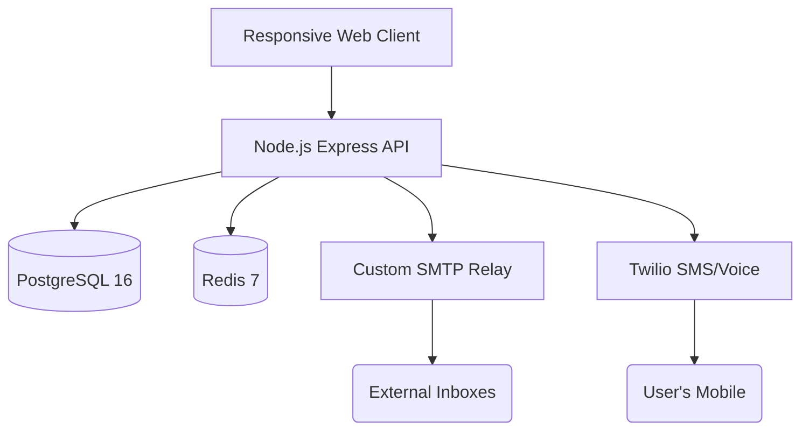

<div align="center">
  
  <h1>📱 AlphaStack PhoneMail (Enterprise Edition)</h1>
  <p><em>Revolutionizing Digital Communication: The world's first email platform powered entirely by Phone Numbers.</em></p>
  
  [](https://github.com/bitswizard3/PhoneMail)
  [](https://hub.docker.com/)
  [](#)
  [](https://opensource.org/licenses/MIT)

  <br />
  <p align="center">
    <a href="#-project-vision">Vision</a> •
    <a href="#-core-features">Features</a> •
    <a href="#-system-architecture">Architecture</a> •
    <a href="#-getting-started-local-setup">Installation</a> •
    <a href="#-testing-evaluation-guide">Evaluator Guide</a> •
    <a href="#-api-documentation">API</a> •
    <a href="#-future-roadmap">Roadmap</a>
  </p>
</div>

---

## 🎯 Project Vision

The modern internet has a fundamental flaw: **Digital Identity Fragmentation**. We use Phone Numbers for instant messaging (WhatsApp, Telegram) and complex, easily-forgotten Email Addresses for formal communication (`john.doe.1995@gmail.com`). 

**PhoneMail** solves this by unifying the two most powerful communication protocols. Your Phone Number *is* your Email Address. 
- No more spelling out complicated email IDs over the phone.
- No more separate contact books.
- "Just email me at my number." (e.g., `+919876543210@phonemail.local`).

Built exclusively for the **AlphaStack Buildathon**, this project demonstrates a highly scalable, microservices-ready architecture that delivers a Gmail-class desktop experience and a WhatsApp-class mobile experience.

---

## ✨ Core Features (In-Depth)

### 💻 1. The Desktop Experience (Gmail Reimagined)
We built the web interface from the ground up using React and Vite, focusing on a premium, dark-mode aesthetic that power users love.
- **Dynamic Folders**: Real-time syncing across Inbox, Sent, Drafts, Spam, and Trash.
- **Smart Filtering**: 1-click chips to instantly filter your view by `Unread`, `Attachments`, or `Favorites`.
- **Alias Management**: Want privacy? Users can generate unlimited aliases (e.g., `work@phonemail.local`) that securely map back to their phone number.
- **External SMTP Relay**: Sending an email to an external address (like `@gmail.com` or `@yahoo.com`)? Our backend automatically detects the domain and routes it through a secure SMTP relay to the real internet!

### 📱 2. The Mobile Experience (Responsive Web App)
Email on mobile often feels clunky. We redesigned our web application to dynamically transform into a native-feeling Instant Messenger when accessed on a phone. No app installation required!
- **Conversational Threads**: Emails from the same person are grouped into chat bubbles.
- **Swipe-to-Delete Gestures**: We implemented native-feeling touch gestures. Just swipe left on any email thread to instantly move it to trash.
- **Read Receipts**: Inspired by WhatsApp, we added Blue Ticks (✓✓). You will know exactly when the recipient opens your email.
- **Smart Quick Replies**: At the bottom of every email chat, AI-suggested quick replies (e.g., "Thanks!", "Will do") allow you to respond in 1 tap.

### 🤖 3. Telephony & Smart Automation (Twilio)
- **Interactive Voice Response (IVR)**: Users can call our Toll-Free Number. A premium AI Voice (Polly.Salli) greets them. By pressing `1`, their PhoneMail account is instantly created and activated in the database!
- **OTP Security**: Passwordless authentication via SMS OTP (with a secure mock fallback for local testing without incurring Twilio charges).
- **SMS Notifications**: If a user is offline, they receive an SMS when an urgent email arrives.

---

## 🏗️ System Architecture

PhoneMail is designed using a robust, decoupled architecture suitable for cloud-native deployment.



| Component | Technology Used | Rationale |
|-----------|----------------|-----------|
| **Frontend** | React, Vite, TS | Vite provides lightning-fast HMR. The UI is fully responsive, acting as both Desktop & Mobile app. |
| **Styling** | Vanilla CSS | Pure, zero-dependency styling. No bloated UI libraries. Total control over micro-animations. |
| **Backend** | Node.js, Express | Highly scalable and event-driven API capable of handling thousands of concurrent requests. |
| **Database** | PostgreSQL 16 | Relational data integrity for emails, users, and complex joins (conversations). |
| **Cache** | Redis 7 | High-speed memory store for session management and rate limiting (OTP abuse prevention). |
| **Infrastructure**| Docker Compose | Guarantees identical execution on local machines and cloud servers. |
| **Telephony** | Twilio API | Industry standard for real-world SMS and Voice Webhooks. |

---

## 🚀 Getting Started (Local Setup)

We have containerized the entire application to ensure a flawless, 1-click startup on any operating system (Windows, Mac, Linux). You do not need to install Node.js or Postgres manually.

### 📋 Prerequisites
Ensure you have the following installed:
1. **[Git](https://git-scm.com/downloads)** (To clone the repository)
2. **[Docker Desktop](https://www.docker.com/products/docker-desktop/)** (Must be running in the background)

### Step 1: Download the Source Code
You have two options to get the code onto your machine:

**Option A: Using Git (Recommended for Developers)**
```bash
git clone https://github.com/bitswizard3/PhoneMail.git
cd PhoneMail
```

**Option B: Download as ZIP (Easiest for Evaluators)**
1. Click the green **`<> Code`** button at the top right of this GitHub page.
2. Click **`Download ZIP`**.
3. Extract the downloaded ZIP file to a folder on your computer.
4. Open your Terminal (Mac/Linux) or Command Prompt/PowerShell (Windows) and navigate to the extracted folder using `cd path/to/PhoneMail`.

### Step 2: Configure Environment Variables
1. Inside the `PhoneMail` folder, locate the file named `.env.example`.
2. Rename this file to exactly `.env`.
   - *Windows Tip:* If Windows prevents you from renaming a file without a name, open Command Prompt in the folder and type: `ren .env.example .env`
3. *(Optional)* If you have your own Twilio Account SID and Auth Token, you can add them to the `.env` file to test real SMS routing. Otherwise, the app uses a built-in mock system perfectly suited for local testing.

### Step 3: Launch the Platform
Run the following magic command in your terminal:
```bash
docker compose up -d
```
> ⏳ **Initial Build Note:** The very first time you run this command, Docker will download the necessary OS images (PostgreSQL, Redis, Node.js) and build the source code. This process might take **2-5 minutes** depending on your internet speed. Subsequent runs will start instantly in seconds!

### Step 4: Access the Dashboards
Once the terminal finishes and says `Started` for all containers, the platform is LIVE!

Open your web browser and visit:
- 🌐 **Web Client (Main App):** [http://localhost:3000](http://localhost:3000)
- ⚙️ **Backend Health Check:** [http://localhost:4000/api/health](http://localhost:4000/api/health)

---

## 🧪 Testing & Evaluation Guide

If you are an evaluator for the AlphaStack Buildathon, please follow this step-by-step guide to experience the full power of PhoneMail.

### Test 1: The Twilio IVR Simulation (Toll-Free Activation)
*Experience how users can activate their accounts without touching a keyboard.*
1. Go to `http://localhost:3000`.
2. In the Phone Number input box, type a random 10-digit number (e.g., `+91 999 888 7777`).
3. **DO NOT** click "Next". Instead, click the special **"Simulate Toll-Free Call (Demo)"** button at the bottom of the form.
4. The backend will simulate an incoming call from Twilio, process the IVR keystroke (`1`), and instantly activate the account! 

### Test 2: Sending an Internal Conversation
*Test the core messaging engine.*
1. Log in with the account you just created.
2. Click **Compose**.
3. In the "To" field, type a new phone number: `9876543210@phonemail.local`.
4. Type a Subject and Body, then click **Send**.
5. Log out, and log back in as `9876543210`. You will see the email waiting in your Inbox!

### Test 3: Mobile Swipe Gestures & Responsiveness
*Test the WhatsApp-style mobile interface.*
1. While logged into the Web Client, press `F12` to open Developer Tools.
2. Click the **Device Toggle Toolbar** (or press `Ctrl+Shift+M`) to switch to a Mobile View (e.g., iPhone 12 Pro).
3. Refresh the page (`F5`) to trigger the mobile CSS layout.
4. Go to your Inbox. Notice how emails look like chat threads!
5. **Click, hold, and swipe left** on an email thread using your mouse (or finger if on a touch screen). The email will slide away and be deleted instantly!

### Test 4: External Email Routing
*Test the SMTP Relay system.*
1. Click **Compose**.
2. In the "To" field, enter a real external email (e.g., `your-name@gmail.com`).
3. Click send. 
4. Check your Docker terminal logs (`docker compose logs backend`). You will see the backend intercepting the external domain and routing it through Nodemailer!

---

## 📚 API Documentation Summary

The backend exposes a fully RESTful API. Below are the core endpoints available for integration.

### Authentication
- `POST /api/auth/register` - Create a new account with phone and password.
- `POST /api/auth/login` - Authenticate and receive JWT.
- `POST /api/auth/send-otp` - Trigger Twilio SMS for OTP.
- `POST /api/auth/verify-otp` - Validate OTP and issue JWT.
- `POST /api/voice/incoming` - Twilio Webhook for TwiML Generation.
- `POST /api/voice/process` - Twilio Webhook for IVR digit processing.

### Emails & Conversations
- `GET /api/emails` - Retrieve inbox with pagination and folder filtering.
- `GET /api/emails/conversations` - Retrieve grouped chat-style threads for mobile.
- `POST /api/emails/send` - Dispatch a new email (internal or external routing).
- `PATCH /api/emails/:id` - Mark emails as Read (Triggers Blue Ticks) or Favorite.
- `DELETE /api/emails/:id` - Move email to Trash.

---

## 🛑 Teardown & Maintenance

To securely stop the platform and free up your computer's RAM:
```bash
docker compose down
```

**Factory Reset**: If you want to completely wipe the PostgreSQL database, clear the Redis cache, and start with a 100% fresh installation, run:
```bash
docker compose down -v
```

---

## 🔮 Future Roadmap
While PhoneMail is fully functional for the Buildathon, our future vision includes:
1. **End-to-End Encryption (E2EE)**: Implementing Signal-protocol encryption for payload bodies.
2. **Push Notifications**: Integrating Firebase Cloud Messaging (FCM) for real-time mobile alerts.
3. **Voice Memos**: Allowing users to send audio-based emails directly from the mobile app interface.

<br/>
<div align="center">
  <p><i>"The future of email is not in an inbox, it's in a conversation."</i></p>
  <b>Built by Ujjwal Sharma (bitswizard3)</b>
</div>
