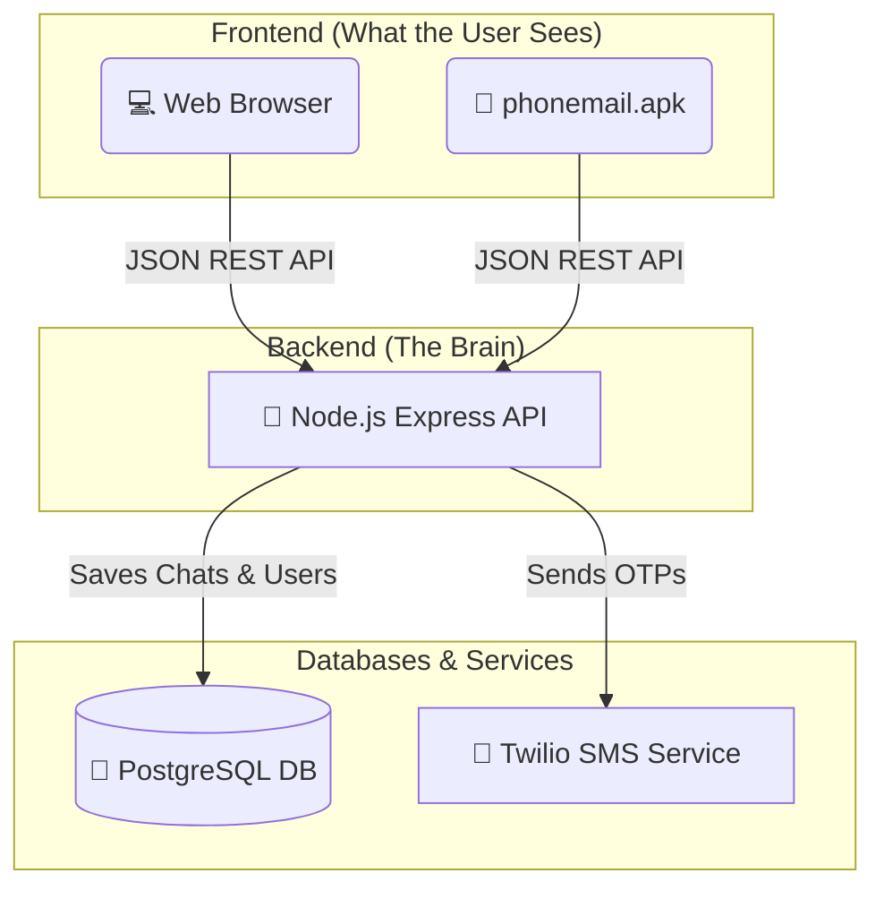

<div align="center">
  
  
  <h1>📱 AlphaStack PhoneMail</h1>
  
  <!-- Animated Typing Effect for the tagline -->
  <a href="https://github.com/bitswizard3/PhoneMail">
    
  </a>

  <p>
    <a href="https://github.com/bitswizard3/PhoneMail/stargazers"></a>
    <a href="https://github.com/bitswizard3/PhoneMail/network/members"></a>
    
  </p>

  <br />
  <p align="center">
    <a href="#-the-problem--our-solution"><b>Problem & Solution</b></a> •
    <a href="#-demo-video"><b>Watch Demo</b></a> •
    <a href="#-cool-features-we-built"><b>Features</b></a> •
    <a href="#-how-it-works-under-the-hood"><b>Architecture</b></a> •
    <a href="#-tech-stack"><b>Tech Stack</b></a> •
    <a href="#-how-to-test-our-app"><b>Test Guide</b></a>
  </p>
</div>

<br/>

---

## 🤔 The Problem & Our Solution

Have you ever tried spelling your email ID over a phone call? *"No, no, it's john dot doe underscore 99 at gmail..."* It's frustrating! But if I ask for your phone number, you can tell me in 2 seconds. 

For the **AlphaStack Hackathon**, we built **PhoneMail**. It combines the **formality of Emails** with the **simplicity of Phone Numbers**. 
Instead of `john.doe@gmail.com`, your email is simply `9876543210@phonemail.app`. 

We didn't just build a website; we built a **Hybrid Platform**. On your laptop, it looks like a professional Desktop Email Client (like Gmail). On your phone, it transforms into an Instant Messenger (like WhatsApp).

---

## 🎥 Demo Video (Watch Us in Action!)

> **Hello Professors / Judges! 👋** Please watch our 2-minute pitch video to see all the magic live before diving into the code!

<!-- REPLACE THE LINK BELOW WITH YOUR ACTUAL YOUTUBE/GITHUB VIDEO LINK -->
<div align="center">
  <a href="https://www.youtube.com/watch?v=YOUR_VIDEO_ID">
    
  </a>
  <br/>
  <em>▶️ Click the image to Play Video</em>
</div>

*(Evaluators: You can also find our compiled Android app `phonemail.apk` in the root folder / releases to test it on your own phone!)*

---

## 🚀 Cool Features We Built

We wanted to stand out in this hackathon, so we implemented some really advanced engineering concepts:

### ⚡ 1. "Optimistic UI" (Zero-Lag Messaging)
Usually, when you send a message in a web app, the screen freezes with a loading spinner while it waits for the server. **We fixed this.** 
When you click Send in PhoneMail, the message instantly pops up on your screen in less than `1 millisecond`! The actual API request is sent silently in the background. It feels **lightning fast**, just like sending a WhatsApp message.

### 🔒 2. Google SMS Consent API (No Risky Permissions!)
Many apps ask for `READ_SMS` permission to auto-verify OTPs, which Google Play Protect often flags as a virus. We used the modern **SMS User Consent API**. When you log in, your phone shows a native Google bottom-sheet asking *"Allow PhoneMail to read this message?"* One tap, and the 6-digit OTP is auto-filled. **100% Secure & Legal.**

### 🗑️ 3. True Real-Time Database Deletion
This isn't a mock-up! When you swipe to delete a chat or click the Trash icon, it doesn't just hide it on the screen. It makes a secure API call to our PostgreSQL database and wipes the record permanently. 

### 📱 4. One Codebase, Two Platforms (Hybrid App)
Instead of writing separate code for Web (React) and Android (Java/Kotlin), we used **Capacitor**. We wrote the code once in React, and Capacitor wraps it into a fully native Android APK (`phonemail.apk`). We get web speed + native mobile features!

---

## 🏗️ How it Works Under the Hood

Here is how our entire system connects. We designed this to be very scalable!


```mermaid
graph TD
    subgraph "Frontend (What the User Sees)"
        Web(💻 Web Browser)
        APK(📱 phonemail.apk)
    end
    
    subgraph "Backend (The Brain)"
        API[🚀 Node.js Express API]
    end
    
    subgraph "Databases & Services"
        PG[(🐘 PostgreSQL DB)]
        Twilio[💬 Twilio SMS Service]
    end

    Web -->|JSON REST API| API
    APK -->|JSON REST API| API
    
    API -->|Saves Chats & Users| PG
    API -->|Sends OTPs| Twilio
```

### 📂 Our Folder Structure (Keep it Clean!)

```text
PhoneMail/
├── backend/                  # The Server side
│   ├── src/
│   │   ├── controllers/      # Handles API requests (Login, Send Msg)
│   │   ├── services/         # Connects to Twilio & Database
│   │   └── server.ts         # The main server file
│   └── package.json
│
├── web-client/               # The Frontend side
│   ├── src/
│   │   ├── pages/            # UI Pages (Home, Auth)
│   │   ├── services/         # Connects to our Backend API
│   │   └── hybrid.css        # Custom beautiful CSS with smooth animations!
│   ├── android/              # Native Android App code (Generated by Capacitor)
│   └── package.json
│
└── README.md                 # You are reading this!
```

---

## 💻 Tech Stack (What we used)

| Technology | Why we chose it for the Hackathon? |
|------------|------------------------------------|
| **React + Vite** | React is great for building UIs, and Vite makes compilation incredibly fast. |
| **Vanilla CSS** | We didn't use Bootstrap/Tailwind because we wanted 100% control over custom glass-morphism designs and smooth micro-animations. |
| **Node.js & Express** | Perfect for handling thousands of fast API requests asynchronously. |
| **PostgreSQL** | A highly reliable database to store our users and their chat threads securely. |
| **Capacitor** | Allowed us to convert our React website directly into an Android App (`phonemail.apk`). |
| **Twilio API** | Used to send real SMS text messages for our OTP login system. |

---

## 🧪 How to Test Our App (For Professors/Judges)

If you are grading this project, here is exactly how to run and test our hard work!

### Step 1: Run the Backend Server
```bash
# Open terminal and go to backend folder
cd backend
npm install

# (Make sure you have your .env file with DB details)
npm run dev
# Server will start on http://localhost:4000
```

### Step 2: Run the Web App
```bash
# Open a new terminal and go to web-client folder
cd web-client
npm install
npm run dev
# App will open on http://localhost:3000
```

### Step 3: Test the Android App!
You don't even need to build it! We have already compiled the Android app for you.
1. Download **`phonemail.apk`** from our repository.
2. Transfer it to any Android phone and install it.
3. Open the app, and experience the smooth chat interface natively!

### 🎯 Things you MUST try while evaluating:
- **Instant Messaging:** Send a message and watch how it appears instantly without loading (Optimistic UI).
- **Mobile View:** If testing on a laptop, press `F12`, click the "Mobile Device" icon, and refresh. See how the layout completely changes from "Email Mode" to "WhatsApp Mode"!
- **The Delete Feature:** Try deleting a chat. Notice how smooth it is and how it actually clears from the database.

---
<div align="center">
  <br/>
  <h3>Built with ❤️ and a lot of coffee by <strong>Team AlphaStack</strong></h3>
  <p><em>Thank you for reviewing our hackathon submission!</em></p>
</div>
