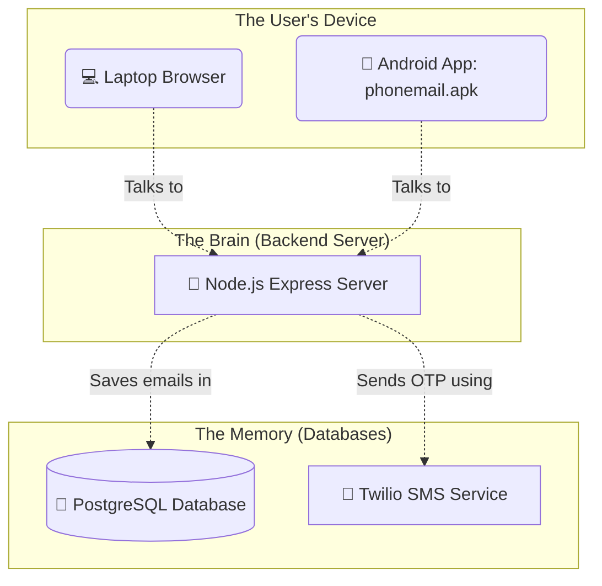

<div align="center">
  
  
  <h1>📱 PhoneMail: Email Made Easy for Everyone</h1>
  
  <!-- Animated Typing Effect -->
  <a href="https://github.com/bitswizard3/PhoneMail">
    
  </a>

  <p>
    <a href="https://github.com/bitswizard3/PhoneMail/stargazers"></a>
    
  </p>
  
  <p><em>This project was built for the <strong>AlphaStack Hackathon</strong>, working on the brilliant idea, task, and technology stack guided by our Professor.</em></p>

  <br />
  <p align="center">
    <a href="#-why-did-we-build-this"><b>Why We Built This</b></a> •
    <a href="#-demo-video"><b>Watch Demo</b></a> •
    <a href="#-the-magic-features"><b>Magic Features</b></a> •
    <a href="#-how-it-all-works"><b>How It Works</b></a> •
    <a href="#-how-to-test-the-app"><b>Test Guide</b></a>
  </p>
</div>

<br/>

---

## 👨‍🌾 Why Did We Build This? (The Core Vision)

Imagine you live in a village, or you are an older person who doesn't use computers much. If someone asks for your email address, you might get confused. Remembering English spellings, special characters (`_`, `.`), and passwords like `Ramesh.kumar_1965@gmail.com` is extremely hard for non-techy or rural people. 

But **everyone remembers their 10-digit phone number!**

Following our Professor's vision, we built **PhoneMail**. The idea is incredibly simple: **Your phone number is your email address.**
Instead of giving someone a long, confusing email ID, a farmer or a grandfather can simply say: 
*"Send the email to my number: 9876543210@phonemail.app"*

We wanted to make sending an email as easy as sending a WhatsApp message. No passwords to remember, no confusing buttons. Just type a message and hit send!

---

## 🎥 Demo Video (See the Magic in Action)

> **Hello Evaluators & Professors! 👋** Before checking the code, please watch this simple 2-minute video to see how easily anyone can use this app.

<!-- REPLACE THE LINK BELOW WITH YOUR ACTUAL YOUTUBE/GITHUB VIDEO LINK -->
<div align="center">
  <a href="https://www.youtube.com/watch?v=YOUR_VIDEO_ID">
    
  </a>
  <br/>
  <em>▶️ Click the image to Play Video</em>
</div>

*(We also included the ready-to-use Android app named `phonemail.apk` in this repository so you can install and test it immediately!)*

---

## ✨ The Magic Features (Explained Simply)

We used some very advanced technology to make the app feel incredibly easy and fast for the end-user. Here is what we did in simple words:

### ⚡ 1. The "Magic" Send Button (Optimistic UI)
Normally, when you send a message on a website, the screen freezes for a few seconds. A little circle spins while the computer talks to the server over the internet. This can be confusing for older people who might think the app is broken.
**What we did:** When you click "Send" in PhoneMail, the message instantly pops up on your screen like magic (in 1 millisecond!). Behind the scenes, the app quietly talks to the server. To the user, it feels lightning-fast, just like WhatsApp!

### 🔒 2. The Auto-Magic Password (Google SMS Consent)
Non-techy people hate passwords because they forget them. So, we use OTPs (One Time Passwords) sent via SMS. 
But typing an OTP is also hard! Some apps force you to give them full permission to read all your private SMS messages, which is very dangerous and bad for privacy.
**What we did:** We used a very safe tool given by Google (SMS User Consent API). When the OTP SMS arrives, the phone itself shows a small box at the bottom asking, *"Allow PhoneMail to read this?"*. The user just taps "Allow", and the code fills itself in! Safe, easy, and no typing needed.

### 🗑️ 3. Real Permanent Deletion
In many student projects, clicking "Delete" just hides the message on the screen, but it stays in the database. 
**What we did:** We made a real connection. When a user clicks the Trash icon or swipes a chat to the left (just like on a smartphone), the app talks directly to our main database and permanently destroys that message record. 

### 📱 4. One App for Everything (Hybrid Tech)
We didn't want to build a website and an Android app separately. 
**What we did:** We wrote the code once using React (for the web), and then we used a special tool called **Capacitor** to wrap that exact same website inside an Android App (`phonemail.apk`). It gives you the smooth feel of a real mobile app without doing double the work!

### 📖 5. The Smart Contact Picker
Typing a 10-digit number is annoying. We added a "Pick from Contacts" button! It securely opens your phone's contact book so you can just tap on a name. No typing required, and it doesn't even need creepy background permissions!

### ✏️ 6. Save Friendly Names
If an unknown number emails you, you don't have to memorize it. You can click a small pencil icon next to the number and save it as "Papa" or "Rahul". The app remembers this forever, just like saving a contact!

### ⏩ 7. Multi-Select & Forwarding
Just like modern chat apps, you can **Long-Press** on any chat or message! This lets you select multiple chats to delete them all at once, or select a message to instantly **Forward** it to someone else with a single tap.

---

## 🏗️ How It All Works (For the Judges)

Here is a simple map of how the different pieces of technology talk to each other. We used the exact tech stack recommended by our Professor to ensure it can handle thousands of users.


```mermaid
graph TD
    subgraph "The User's Device"
        Web(💻 Laptop Browser)
        APK(📱 Android App: phonemail.apk)
    end
    
    subgraph "The Brain (Backend Server)"
        API[🚀 Node.js Express Server]
    end
    
    subgraph "The Memory (Databases)"
        PG[(🐘 PostgreSQL Database)]
        Twilio[💬 Twilio SMS Service]
    end

    Web -. "Talks to" .-> API
    APK -. "Talks to" .-> API
    
    API -. "Saves emails in" .-> PG
    API -. "Sends OTP using" .-> Twilio
```

### 📂 Our Folder Structure (Where is everything?)

We kept our files very organized. Think of it like a house with two main rooms:

```text
PhoneMail/
├── backend/                  # ROOM 1: The Server (Invisible to the user)
│   ├── src/
│   │   ├── controllers/      # The workers who process login and send emails
│   │   ├── services/         # The tools (Connects to Database & Twilio SMS)
│   │   └── server.ts         # The main switchboard that turns the server on
│   └── package.json
│
├── web-client/               # ROOM 2: The Website/App (What the user sees)
│   ├── src/
│   │   ├── pages/            # The screens (Home Screen, Login Screen)
│   │   ├── services/         # The messengers that talk to the Backend Room
│   │   └── hybrid.css        # The paint (Colors, buttons, and animations)
│   ├── android/              # The special wrapper that makes it an Android App
│   └── package.json
│
└── README.md                 # This instruction manual!
```

---

## 💻 The Technology Stack

We used modern, industry-standard tools for this hackathon:

- **React + Vite (Frontend):** React is like building with Lego blocks; we create a button once and use it everywhere. Vite is the super-fast engine that puts the blocks together.
- **Node.js + Express (Backend):** The brain that runs constantly on the server to listen to user requests (like "send this email").
- **PostgreSQL (Database):** A giant digital filing cabinet. It securely stores all user accounts and their email messages.
- **Capacitor:** The magic wrapper tool. It takes our React website and turns it into a real Android `.apk` file that you can install on your phone.
- **Twilio API:** A real-world service we connected to so our app can send actual SMS messages to real phone numbers.

---

## 🧪 How to Test the App (Evaluator Guide)

Professor/Judges, we have made it very easy for you to test our app. You can test it on a computer or directly on an Android phone.

### Option 1: Test on an Android Phone (Easiest)
1. Download the file named **`phonemail.apk`** from our project folder (or the Releases tab).
2. Send it to your Android phone and click it to install.
3. Open the app. You will see how beautiful and smooth the "WhatsApp-like" email experience is on a mobile screen!

### Option 2: Test on your Computer
If you want to run the code yourself on your laptop, follow these simple steps:

**Step 1: Start the Backend (The Brain)**
Open your terminal (command prompt), go into the backend folder, and start it:
```bash
cd backend
npm install
npm run dev
# The brain is now awake at http://localhost:4000
```
*(Note: You will need a `.env` file with your Database and Twilio keys!)*

**Step 2: Start the Web App (The Screen)**
Open a **new** terminal, go into the web folder, and start it:
```bash
cd web-client
npm install
npm run dev
# The screen is now live at http://localhost:3000
```

### 🎯 Things to check while evaluating:
- **Test the Magic Send:** Send an email and notice how there is **zero waiting time**. The message appears instantly!
- **Test the Contact Picker:** Click the '+' button and tap "Pick from Contacts" on your phone.
- **Test Saving Names:** Click the pencil icon next to any number at the top of a chat to save a friendly name.
- **Test Multi-Select:** **Long-press** any chat from the list (or any message) to select multiple items, forward them, or delete them in bulk!
- **Test the Chat Delete:** Try deleting an email chat. It's not a fake delete; it actually commands the PostgreSQL database to erase the data.
- **Test the View:** If you use it on a computer, it looks like a wide email app. If you shrink your browser window to mobile size, it instantly changes its design to look exactly like a mobile chat app!

---
<div align="center">
  <br/>
  <h3>Built with ❤️ for the AlphaStack Hackathon</h3>
  <p><em>Thank you to our Professor for the incredible vision, task, and guidance!</em></p>
</div>
