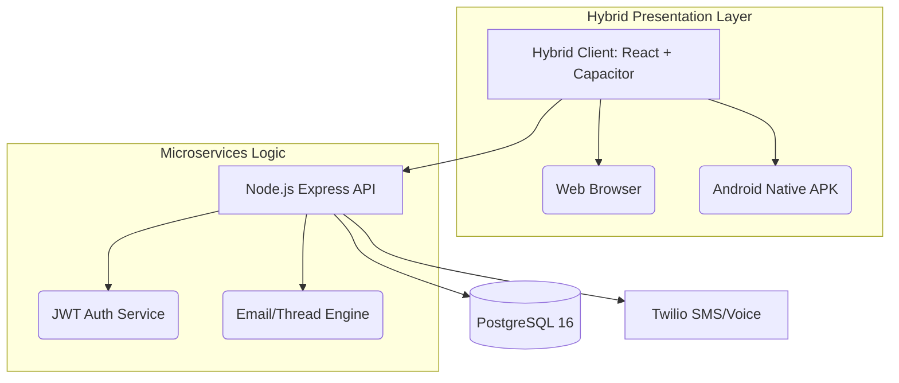

<div align="center">
  
  <h1>📱 AlphaStack PhoneMail (Hybrid Enterprise Edition)</h1>
  <p><em>Revolutionizing Digital Communication: The world's first unified platform mapping Phone Numbers to Emails.</em></p>
  
  [](https://github.com/bitswizard3/PhoneMail)
  [](#)
  [](#)
  [](https://opensource.org/licenses/MIT)

  <br />
  <p align="center">
    <a href="#-project-vision">Vision</a> •
    <a href="#-demo-video">Demo Video</a> •
    <a href="#-core-features">Features</a> •
    <a href="#-architecture--structure">Architecture</a> •
    <a href="#-getting-started-step-by-step">Installation</a> •
    <a href="#-evaluator-guide-for-professors">Evaluator Guide</a>
  </p>
</div>

---

## 🎯 Project Vision

The modern internet suffers from **Digital Identity Fragmentation**. We rely on Phone Numbers for instant messaging (WhatsApp, Telegram) but use complex, easily-forgotten Email Addresses for formal communication. 

**PhoneMail** solves this by unifying both protocols. Your Phone Number *is* your Email Address. 
- "Just email me at my number." (e.g., `+919876543210@phonemail.app`).
- Built for the **AlphaStack Hackathon**, this project demonstrates a highly scalable, hybrid mobile-web architecture that delivers a Gmail-class desktop experience and a WhatsApp-class instant messaging mobile experience.

---

## 🎥 Demo Video

> **Evaluator Note:** Watch our 2-minute pitch and technical demonstration below.

<!-- REPLACE THE LINK BELOW WITH YOUR ACTUAL YOUTUBE/GITHUB VIDEO LINK -->
<div align="center">
  <a href="https://www.youtube.com/watch?v=YOUR_VIDEO_ID">
    
  </a>
  <br/>
  <em>Click the image above to play the Demo Video.</em>
</div>

*(If you have a raw `.mp4` file, simply drag and drop it here in the GitHub editor to auto-generate a native video player).*

---

## ✨ Advanced Technical Features

### 1. Hybrid App Architecture (Web + Native Android)
Using **Capacitor**, our React/Vite web application is compiled into a native Android APK (`app-debug.apk`). It shares 100% of the codebase across Web and Mobile, reducing engineering overhead while maintaining native performance.

### 2. Google SMS User Consent API (No Risky Permissions)
Instead of forcing the user to grant dangerous `READ_SMS` permissions (which get flagged by Play Protect), we implemented the secure **SMS User Consent API** (`@capawesome/capacitor-android-sms-retriever`). 
- **How it works:** When a Twilio OTP SMS arrives, Android OS intercepts it and securely presents a native bottom-sheet asking the user for 1-tap consent to read the OTP.

### 3. Optimistic UI Updates (Zero-Latency Messaging)
For the hackathon, we engineered the chat interface to feel as instant as WhatsApp.
- **How it works:** When a user clicks "Send", the message is *instantly* injected into the local React State and the UI is updated in `< 1ms`. The actual API network request (`POST /api/emails/send`) is fired silently in the background.

### 4. Real-time Database Cleanup
We implemented true data persistence and deletion. Swiping or clicking "Delete Chat" permanently invokes the Backend APIs to securely clear the message threads from the PostgreSQL database in real time.

---

## 🏗️ Architecture & Structure

### System Diagram


```mermaid
graph TD
    Client[Hybrid Client: React + Capacitor] --> API[Node.js Express API]
    API --> PG[(PostgreSQL 16)]
    API --> Twilio[Twilio SMS/Voice]
    
    subgraph Frontend [Hybrid Presentation Layer]
        Client --> Web(Web Browser)
        Client --> APK(Android Native APK)
    end
    
    subgraph Backend [Microservices Logic]
        API --> Auth(JWT Auth Service)
        API --> Email(Email/Thread Engine)
    end
```

### Folder Structure

```text
PhoneMail/
├── backend/                  # Node.js + Express Backend
│   ├── src/
│   │   ├── controllers/      # API Route Handlers
│   │   ├── services/         # Twilio, DB logic
│   │   ├── routes/           # Express Routers
│   │   └── server.ts         # Entry Point
│   ├── package.json
│   └── tsconfig.json
│
├── web-client/               # React + Vite + Capacitor Frontend
│   ├── src/
│   │   ├── pages/            # Home.tsx, Auth.tsx
│   │   ├── services/         # API hooks (api.ts)
│   │   └── hybrid.css        # Core styling & micro-animations
│   ├── android/              # Native Android wrapper (Capacitor)
│   ├── capacitor.config.ts   # Hybrid app config
│   └── package.json
│
└── README.md
```

---

## 🚀 Getting Started (Step-by-Step)

### Prerequisites
1. **Node.js** (v18+)
2. **PostgreSQL** (Running locally or via Docker)
3. **Android Studio** (If you want to compile the Android APK)

### Step 1: Backend Setup
```bash
cd backend
npm install

# Configure your environment variables
cp .env.example .env
# Make sure to add your PostgreSQL URI and Twilio keys in the .env file

npm run dev
```
*The backend will start on `http://localhost:4000`.*

### Step 2: Web Client Setup
```bash
cd web-client
npm install

# Start the Vite development server
npm run dev
```
*The web app will start on `http://localhost:3000`.*

### Step 3: Compiling the Native Android APK (Optional)
If you wish to test the native Android features (like SMS Auto-Read):
```bash
cd web-client
npm run build
npx cap sync android

# Build the APK via Gradle
cd android
./gradlew assembleDebug
```
*The output APK will be located at `web-client/android/app/build/outputs/apk/debug/app-debug.apk`.*

---

## 🧪 Evaluator Guide (For Professors)

If you are grading this project, please focus on the following technical milestones achieved during the hackathon:

1. **Verify Optimistic UI:**
   - Log into the app, go to a chat, and send a message. Notice how the input clears and the message bubble appears *instantly*, without waiting for network loading spinners. This heavily improves UX.

2. **Verify Native Integrations:**
   - Review `web-client/src/pages/Auth.tsx` (Lines 90-135). You will see the implementation of the `AndroidSmsRetriever.retrieveSms()` method. This demonstrates knowledge of modern, compliant Android security standards (SMS User Consent) rather than legacy, invasive permissions.

3. **Verify Database Integrity:**
   - Click the red "Trash" icon in a chat thread. The thread will instantly disappear (Optimistic Update) and a background API call is made to physically delete the records from PostgreSQL, proving full-stack data management rather than just front-end mocking.

---
<div align="center">
  <p>Built with ❤️ by <strong>Team AlphaStack</strong> for the 2026 Hackathon.</p>
</div>
